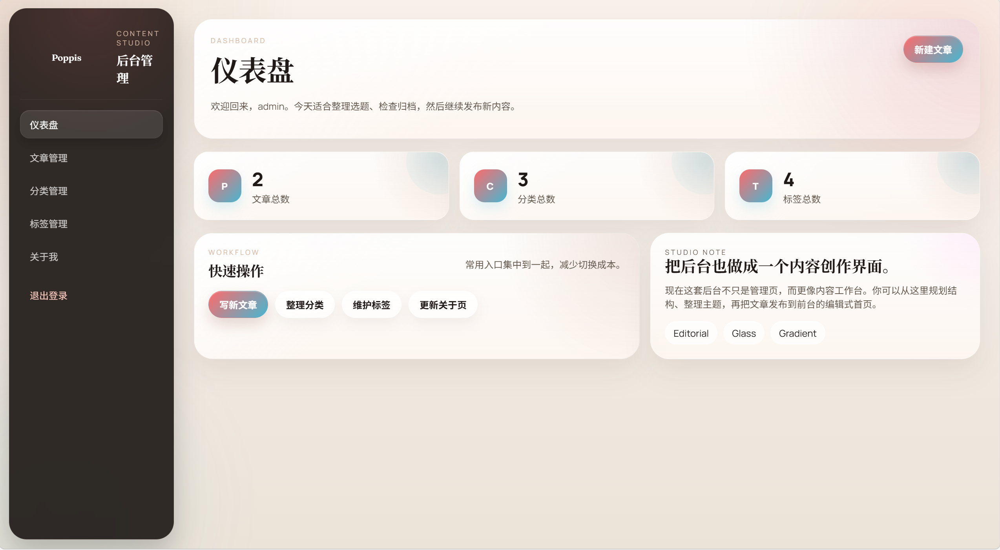

# 个人博客 2.0

## 界面预览

### 首页


### 后台



一个基于 Node.js + Express + SQLite 的个人博客系统，兼顾内容展示、后台管理和轻量部署体验。

## 项目亮点

- Markdown 写作，适合日常更新和技术博客
- 前后台分离视图，包含完整管理后台
- 分类、标签、草稿、封面图等内容管理能力
- SQLite 轻量存储，适合个人网站和低维护场景
- 响应式页面，兼容桌面端和移动端
- 支持 PM2 与 Nginx，方便部署到云服务器

## 功能概览

### 前台

- 首页文章列表与分页展示
- 文章详情页
- 分类页与标签页
- 关于我页面
- 阅读量统计

### 后台

- 管理员登录与退出
- 新建、编辑、删除文章
- 草稿 / 发布状态管理
- 分类管理
- 标签管理
- 关于页内容编辑
- 图片上传

### 安全与基础能力

- Session 鉴权
- 后台路由保护
- 密码加密存储
- 上传文件类型与大小限制
- 环境变量配置支持

## 技术栈

- Node.js
- Express
- EJS
- SQLite
- express-session
- bcryptjs
- multer
- marked

## 快速开始

### 1. 安装依赖

```bash
npm install
```

### 2. 配置环境变量

复制 `.env.example` 并按需修改：

```env
PORT=3001
SESSION_SECRET=replace-with-a-long-random-string
DATABASE_PATH=./database/blog.db
ADMIN_USERNAME=admin
ADMIN_PASSWORD=replace-this-password-before-first-deploy
```

### 3. 初始化数据库

```bash
npm run init-db
```

初始化后会创建基础表结构，并写入默认管理员、分类和标签数据。

### 4. 启动项目

```bash
npm start
```

开发模式：

```bash
npm run dev
```

默认访问地址：

- 前台：`http://localhost:3001`
- 后台：`http://localhost:3001/admin/login`

## 默认数据说明

- 管理员账号来自 `ADMIN_USERNAME` / `ADMIN_PASSWORD`
- 如果未设置，初始化脚本会回退为默认值
- 默认内置若干分类与标签，便于开箱即用

首次部署后建议立刻修改管理员密码，并替换为强随机 `SESSION_SECRET`。

## 项目结构

```text
personal-blog/
├── config/          # 数据库配置
├── middleware/      # 鉴权与上传中间件
├── public/          # 静态资源
├── routes/          # 前后台路由
├── scripts/         # 初始化与辅助脚本
├── views/           # EJS 页面模板
├── database/        # SQLite 数据目录
├── uploads/         # 上传文件目录
├── package.json
└── server.js
```

## 运行脚本

```bash
npm start      # 启动生产模式
npm run dev    # 使用 nodemon 启动开发模式
npm run init-db
```

## 部署建议

### PM2

```bash
npm install -g pm2
pm2 start ecosystem.config.js
pm2 save
pm2 startup
```

### Nginx 反向代理

```nginx
server {
    listen 80;
    server_name your-domain.com;

    location / {
        proxy_pass http://localhost:3001;
        proxy_http_version 1.1;
        proxy_set_header Upgrade $http_upgrade;
        proxy_set_header Connection "upgrade";
        proxy_set_header Host $host;
        proxy_cache_bypass $http_upgrade;
    }
}
```

## 内容管理说明

发布文章时支持以下内容：

- 标题
- URL Slug
- 摘要
- Markdown 正文
- 封面图
- 分类
- 标签
- 发布状态

Markdown 文章中的图片可通过上传后使用相对路径引用。

## 数据与备份

- 数据库默认位于 `database/blog.db`
- 上传资源位于 `uploads/`
- 备份时建议同时保存数据库文件和上传目录

## 适用场景

- 个人技术博客
- 作品展示站
- 轻量内容站点
- 服务器自部署博客系统

## License

MIT
